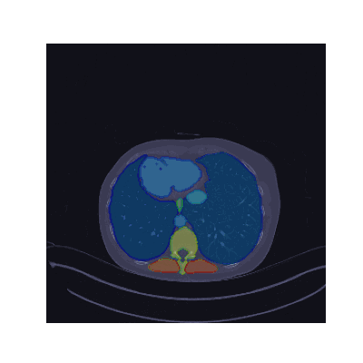

# Nifti2Gif
> Easy data visualization

Transform nifti images to gifs. If you have segmentation masks, you can add them as a second positional argument.

## Installation
Either use pip `pip install nifti2gif` or clone this repository.

## Execute
`nifti2gif  <image.nii.gz> --mask <mask.nii.gz>`

## Options
```bash
--mask <str> # mask with encode classes
--output, -o <str> # name of the output file, default: "output.gif"
--duration <int> # frame duration in ms, default: 80
--no_edges # do not highlight edges of classes
--figsize <int> # figure size (x,x), default: 4
--cmap <str> # color map, default: "bone"
--alpha <float> # transparecy of labels, default: 0.3
--orientation <str> # orientation of image, default: "LPI"
--n_rot90 <int> # rotate the image x times, default: 1
```

